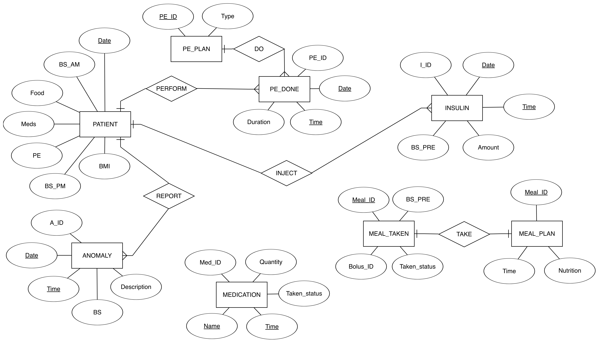

# DiaHCMS
Diabetes Healthcare Management System

Adhering to strict routines everday can be difficult in the midst of tight schedules and daily activities. The DiaHCMS application can be used to ease the process of managing diabetes in the patient’s everyday life. 

The application interacts with the patient my giving reminders about meal timings, medication,etc. , and also by taking the description of any anomalies in the patient’s health or routine as input. 

A MySQL relational database is used in the backend. 

<kbd></kbd>

The patient’s everyday activities and anomalies are stored, along with meal plans, Insulin dosages, and several other routine activities. 

The entries in the database are then used to generate a monthly report, that can be used by the doctor to assess the variation in the patient’s condition. This can further aid in providing suggestions for adapting to and controlling the condition.
